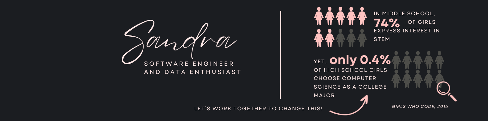

# Hello World! I'm Sandra 👋

I am a master's graduate from Information Technology with a specialisation in business intelligence and have completed additional training as a full-stack software engineer. Recognising a critical need in the industry for professionals who can bridge the gap between business challenges and technology solutions, I transitioned into a tech career. With proven industry expertise and newfound coding skills, I excel in developing data-driven strategies and innovative software solutions for complex industry challenges.

- 🔭 I’m currently working on a mental-health app as part of the hackaton Hack For Change, by Bright Network. I recently complete a 13-week intensive full-stack software engineering bootcamp with Bright Network Technology Academy.
- 🌱 I’m currently learning the use of React and Material UI to build dynamic websites.
- 👯 I’m looking to collaborate on projects towards achieve Net Zero Goals
- 🤔 I’m looking for help with break into the technology industry to land my first tech role.
- 💬 Ask me about my transition from chemical engineering to software engineer.
- 📫 You can reach me on linkedin
- ⚡ Fun fact: I talk to my dog in the most weird voices you have ever heard

## 👩‍💻 Tech Stack
          	

## 💬 Programming Languages

## 📊 GitHub Stats

   
   

